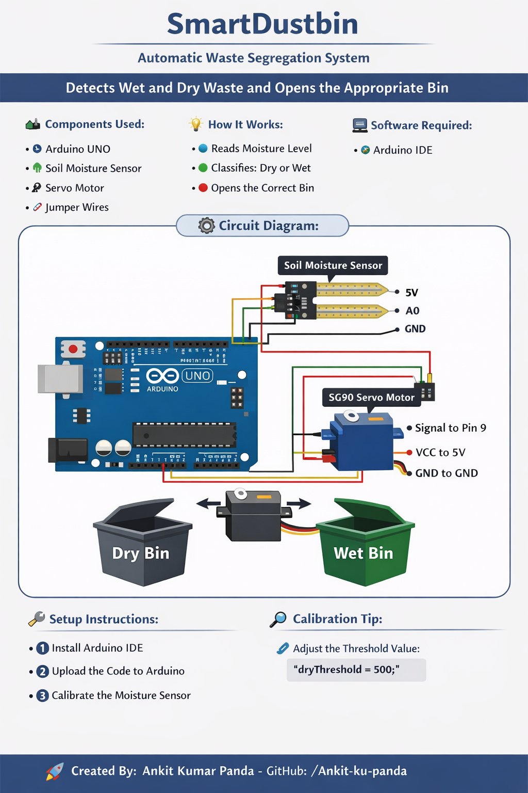

# Smart Dustbin — Arduino Waste Segregation System

An Arduino-based prototype that uses a moisture sensor to classify waste as wet or dry. Based on the sensor reading, a servo motor rotates toward the corresponding waste-bin position.

[](https://www.arduino.cc/)
[](https://docs.arduino.cc/language-reference/)
[](LICENSE)

## Overview

The Smart Dustbin is an embedded-system prototype designed to demonstrate automatic wet and dry waste segregation.

A soil-moisture sensor measures the moisture level of the detected material. The Arduino compares the sensor reading with a configurable threshold and controls a servo motor:

- Dry waste position: `0°`
- Neutral position: `90°`
- Wet waste position: `180°`

The servo remains in the selected position for two seconds before returning to neutral.

## Features

- Automatic wet and dry waste classification
- Analog moisture-level measurement
- Servo-controlled waste direction
- Real-time sensor readings through Serial Monitor
- Adjustable moisture threshold
- Low-cost and beginner-friendly Arduino design
- Included circuit diagram

## Components

| Component | Quantity | Purpose |
|---|---:|---|
| Arduino UNO | 1 | Processes sensor data and controls the servo |
| Soil-moisture sensor | 1 | Measures the moisture level |
| SG90 servo motor | 1 | Directs waste toward the selected position |
| Breadboard | 1 | Provides temporary circuit connections |
| Jumper wires | As required | Connects the components |
| External 5V supply | Recommended | Provides stable power to the servo |
| USB cable | 1 | Uploads code and powers the Arduino |

## Circuit Diagram



## Wiring

### Moisture Sensor

| Sensor Pin | Arduino Pin |
|---|---|
| VCC | 5V |
| GND | GND |
| AO | A0 |

### Servo Motor

| Servo Wire | Connection |
|---|---|
| Signal | Digital pin 9 |
| VCC | 5V supply |
| GND | GND |

> For reliable operation, power the servo from a suitable external 5V supply and connect the external supply ground to Arduino GND. Avoid powering a high-load servo directly from the Arduino 5V pin.

## Software Requirements

- [Arduino IDE](https://www.arduino.cc/en/software)
- Arduino Servo library, included with Arduino IDE

## Repository Structure

```text
SmartDustbin/
├── Circuit.png
├── SmartDustbin.ino
├── LICENSE
└── README.md
```

## Installation

Clone the repository:

```bash
git clone https://github.com/Ankit-ku-panda/SmartDustbin.git
cd SmartDustbin
```

If the code file is named `SmartDustbin.ino.txt`, rename it:

### Windows PowerShell

```powershell
Rename-Item SmartDustbin.ino.txt SmartDustbin.ino
```

### Linux or macOS

```bash
mv SmartDustbin.ino.txt SmartDustbin.ino
```

## Upload the Code

1. Connect the Arduino UNO to your computer.
2. Open `SmartDustbin.ino` in Arduino IDE.
3. Select **Tools → Board → Arduino AVR Boards → Arduino Uno**.
4. Select the correct port from **Tools → Port**.
5. Click **Verify**.
6. Click **Upload**.
7. Open **Tools → Serial Monitor**.
8. Set the baud rate to `9600`.

## How It Works

1. The moisture sensor sends an analog reading to Arduino pin `A0`.
2. Arduino compares the reading with `dryThreshold`.
3. When the reading is below the threshold, the program classifies the material as dry waste.
4. When the reading is equal to or above the threshold, it classifies the material as wet waste.
5. The servo moves to the appropriate position.
6. After two seconds, the servo returns to the neutral position.
7. The process repeats after a two-second delay.

## Calibration

The default threshold is:

```cpp
int dryThreshold = 500;
```

Sensor behavior varies depending on the sensor, material and environment. Calibrate it before regular use:

1. Open Serial Monitor at `9600` baud.
2. Record several readings from representative dry materials.
3. Record several readings from representative wet materials.
4. Select a threshold between the two ranges.
5. Update `dryThreshold` in the Arduino sketch.
6. Upload the code again and test it.

If your sensor produces higher readings for dry material and lower readings for wet material, reverse the comparison logic.

## Important Limitations

- A soil-moisture sensor alone cannot reliably identify every type of waste.
- Metal, glass, plastic and mixed materials may be classified incorrectly.
- Repeated sensor exposure to waste can cause contamination and corrosion.
- The current program continuously classifies the sensor reading every two seconds.
- The prototype uses one servo and three positions; the mechanical design must route waste appropriately.
- This is an educational prototype, not an industrial waste-management system.

## Future Improvements

- Add an ultrasonic sensor for touch-free lid activation
- Add bin-level monitoring
- Use separate servos for separate bin lids
- Add metal and proximity sensors
- Add an ESP32 or ESP8266 for IoT monitoring
- Send full-bin alerts to a mobile application
- Add an LCD or OLED status display
- Improve classification using multiple sensors
- Add a detection cooldown to prevent repeated servo movement

## Troubleshooting

### Servo jitters or resets the Arduino

Use a separate regulated 5V supply for the servo and connect all grounds together.

### Sensor readings fluctuate

Take multiple readings and use their average. Also check the sensor wiring and recalibrate the threshold.

### Wrong waste category is selected

Adjust `dryThreshold` or reverse the `<` comparison according to the behavior of your sensor.

### Arduino IDE cannot open the sketch

Make sure the filename ends in `.ino`, not `.ino.txt`.

## Contributing

Contributions are welcome.

1. Fork the repository.
2. Create a branch:

   ```bash
   git checkout -b feature/your-feature
   ```

3. Commit your changes:

   ```bash
   git commit -m "Add your feature"
   ```

4. Push the branch:

   ```bash
   git push origin feature/your-feature
   ```

5. Open a pull request.

For bugs and suggestions, use the repository’s [Issues page](https://github.com/Ankit-ku-panda/SmartDustbin/issues).

## Author

**Ankit Kumar Panda**

- GitHub: [Ankit-ku-panda](https://github.com/Ankit-ku-panda)
- Repository: [SmartDustbin](https://github.com/Ankit-ku-panda/SmartDustbin)

## License

This project is distributed under the [MIT License](LICENSE).

---

If this project helped you, consider giving the repository a star.
